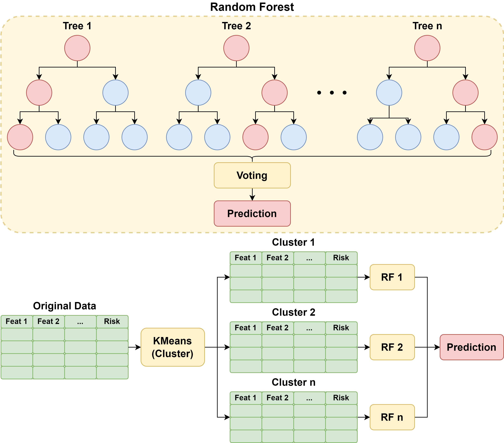
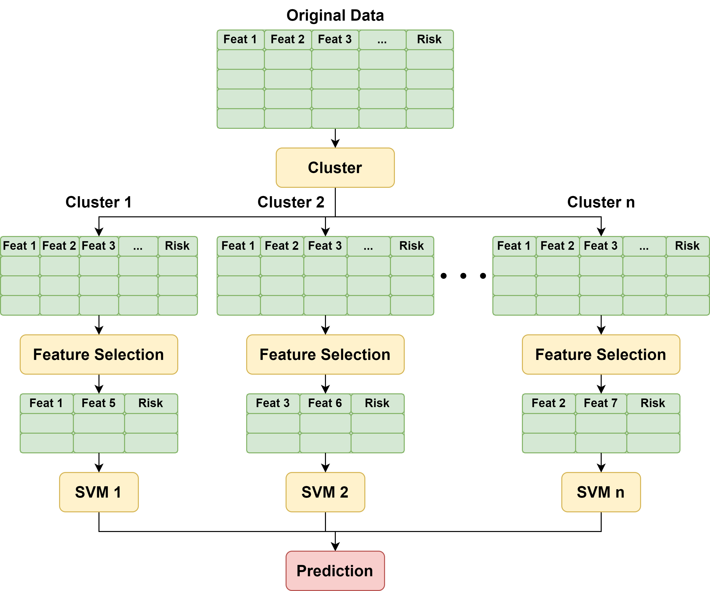
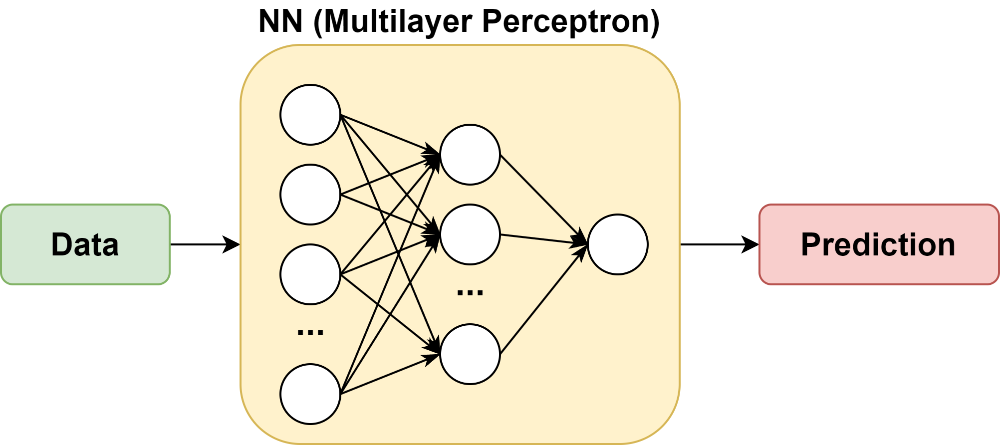

# Heart Attack Prediction

The project was developed for the COMPSCI 760 course

## Authors

Bofan Wang, Yihong Pan, Yifan Zhou, Zhipeng Lin, Huazhe Cheng

## Dataset Overview

The dataset consists of normalized numerical values across a range of features, including:

- **People**: Age, Gender, Income...
- **Health Metrics**: Cholesterol, BMI, Blood Pressure, CK-MB, Troponin, Blood Sugar...
- **Lifestyle Indicators**: Smoking, Alcohol, Exercise, Diet, Sedentary Time, Sleep...
- **Medical History**: Diabetes, Family History, Medication Use, Previous Heart Problems...
- **Target Variable**: Heart Attack Risk (Binary) — 0 (No risk), 1 (High risk)...

## Methodologies

### 1. Cluster + RF

Use **cluster** methods (Kmeans, DBSCAN...) to form groups of people. For each group, build their own **Random Forest**.

### 2. Cluster + (Feature Selection) + SVMs

Apply **cluster** methods. For each cluster, apply **feature selection** methods (e.g. Mutual Information, RFE). Train **SVM classifiers** for each cluster

### 3. Neural Network    

Train a **Multilayer Perceptron (MLP)** with optimal layers and nodes. Predict risk probability directly with NN.

