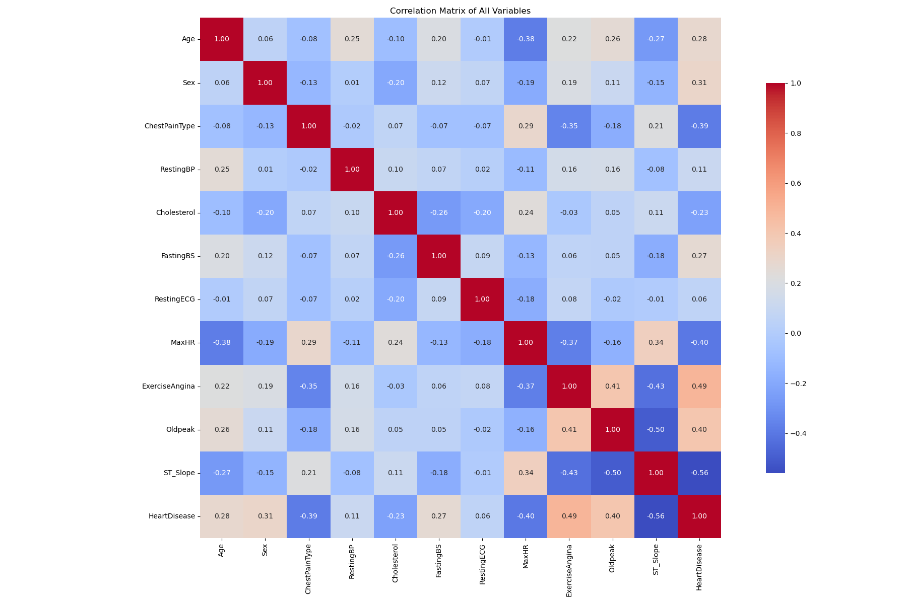
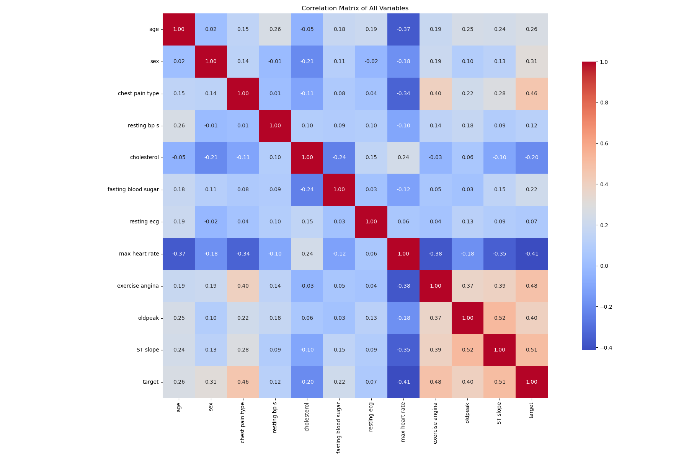
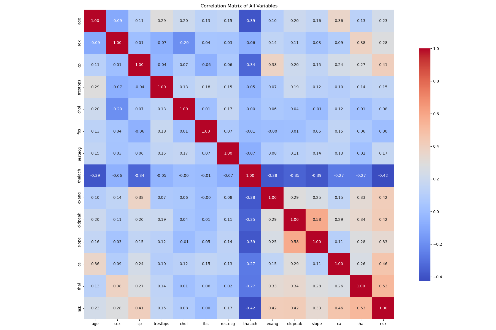

# Heart Attack Prediction

The project was developed for the COMPSCI 760 course

## Group Members

Bofan Wang, Yihong Pan, Yifan Zhou, Huazhe Cheng, Zhipeng Lin

## Dataset Overview

The datasets we use can be available on open resources like Kaggle, IEEE dataset.

The datasets consist of multiple values across a range of features, including:

- **People**: Age, Sex, Exercise...
- **Health Metrics**: Chest Pain Type, Resting Blood Pressure, Cholesterol, Max Heart Rate...
- **Target Variable**: HeartDisease — 0 (No risk), 1 (High risk)...

### 1. Heart Failure Prediction Dataset

- **Name**: `heart.csv`
- **Source**: [Heart Failure Prediction Dataset](https://www.kaggle.com/datasets/fedesoriano/heart-failure-prediction)
- **Description**: 918 rows, 12 columns.
- **Result**: [result_file](./results/heart.csv)
- **Visualization**: 

### 2. Heart Disease Dataset

- **Name**: `heart-1.csv`
- **Source**: [Heart Disease Dataset](https://www.kaggle.com/datasets/johnsmith88/heart-disease-dataset)
- **Description**: 1025 rows, 14 columns.
- **Result**: [result_file](./results/heart-1.csv)
- **Note**: This data set dates from 1988 and consists of four databases: Cleveland, Hungary, Switzerland, and Long Beach V. It contains 76 attributes, including the predicted attribute, but all published experiments refer to using a subset of 14 of them.
- **Visualization**: 

### 3. UCI-1190-11 Dataset

- **Name**: `UCI-1190-11.csv`
- **Source**: [UCI-1190-11 Dataset](https://github.com/Abdulrakeeb/Heart-disease-dataset/blob/main/UCI-1190-11.csv)
- **Description**: 1190 rows, 12 columns.
- **Result**: [result_file](./results/UCI-1190-11.csv)
- **Note**: This heart disease dataset is curated by combining 5 popular heart disease datasets already available independently but not combined before. Records of patients from US, UK, Switzerland and Hungary.
- **Visualization**: 

### 4. Statlog (Heart)

- **Name**: `statlog_heart.csv`
- **Source**: [Statlog (Heart)](https://archive.ics.uci.edu/dataset/145/statlog+heart)
- **Description**: 303 rows, 14 columns.
- **Result**: [result_file](./results/statlog_heart.csv)
- **Visualization**: 

## Methodologies

### Cluster + RF

Use **cluster** methods (Kmeans, DBSCAN...) to form groups of people. For each group, build their own **Random Forest**.

## Experiments

The following table summarizes the performance of different models on the `heart.csv` test set. The metrics used for evaluation include F1 score, accuracy, AUC.

|         Model          |  F1 Score  |  Accuracy  | Balanced Accuracy |  AUC   | 
|:----------------------:|:----------:|:----------:|:-----------------:|:------:|
|          LDA           |   0.7831   |   0.7772   |      0.7938       | 0.9006 |
|   LR                   |   0.7742   |   0.7717   |      0.7910       | 0.9008 |
|      RF (n = 10)       |   0.8223   |   0.8098   |      0.8201       | 0.9121 |
|      RF (n = 20)       |   0.8670   |   0.8533   |      0.8593       | 0.9215 |
|  SVM (kernel = poly)   |   0.8442   |   0.8315   |      0.8406       | 0.8966 |
|   SVM (kernel = rbf)   |   0.8815   |   0.8641   |      0.8632       | 0.9484 |
| SVM (kernel = sigmoid) |   0.8317   |   0.8152   |      0.8211       | 0.8865 |
|        NN (8,)         |   0.8990   |   0.8913   |      0.8936       | 0.9016 |
|       NN (16, 8)       |   0.8558   |   0.8370   |      0.8326       | 0.8971 |
|      NN (32, 16)       |   0.9029   |   0.8913   |      0.8888       | 0.9256 |
|      NN (32, 32)       |   0.8868   |   0.8696   |      0.8632       | 0.9157 |
|     CluRF (k = 4)      | **0.9073** | **0.8973** |    **0.8966**     | 0.8966 |
|     CluRF (k = 6)      | **0.9223** | **0.9140** |    **0.9140**     | 0.9140 |
