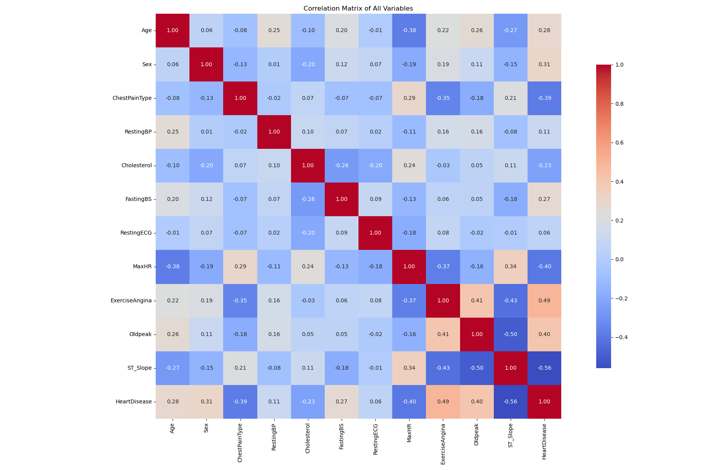
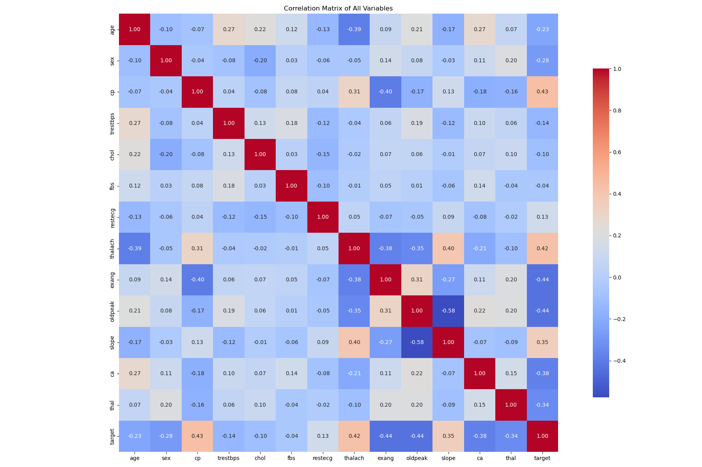
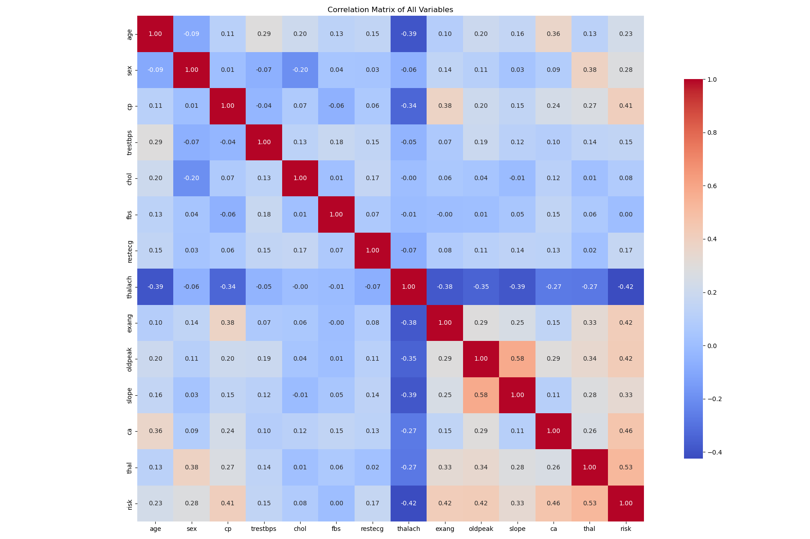

# Dataset Introduction

This directory contains datasets used for training and evaluating the models in this repository.

## 1. Heart Failure Prediction Dataset

- **Name**: `heart.csv`
- **Source**: [Heart Failure Prediction Dataset](https://www.kaggle.com/datasets/fedesoriano/heart-failure-prediction)
- **Description**: 918 rows, 12 columns.
- **Visualization**: 

## 2. Heart Disease Dataset

- **Name**: `heart-1.csv`
- **Source**: [Heart Disease Dataset](https://www.kaggle.com/datasets/johnsmith88/heart-disease-dataset)
- **Description**: 1025 rows, 14 columns.
- **Note**: This data set dates from 1988 and consists of four databases: Cleveland, Hungary, Switzerland, and Long Beach V. It contains 76 attributes, including the predicted attribute, but all published experiments refer to using a subset of 14 of them.
- **Visualization**: 

## 3. UCI-1190-11 Dataset

- **Name**: `UCI-1190-11.csv`
- **Source**: [UCI-1190-11 Dataset](https://github.com/Abdulrakeeb/Heart-disease-dataset/blob/main/UCI-1190-11.csv)
- **Description**: 1190 rows, 12 columns.
- **Note**: This heart disease dataset is curated by combining 5 popular heart disease datasets already available independently but not combined before. Records of patients from US, UK, Switzerland and Hungary.
- **Visualization**: 

## 4. Statlog (Heart)

- **Name**: `statlog_heart.csv`
- **Source**: [Statlog (Heart)](https://archive.ics.uci.edu/dataset/145/statlog+heart)
- **Description**: 270 rows, 14 columns.
- **Visualization**: 

